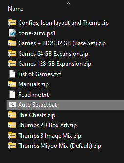

# Done Set Auto Setup
Automated setup of Done Set for Miyoo Mini SD cards

Based around the work done by Quack Walks on their ROM set "Done Set"
https://archive.org/details/done-set

**The Goal:** Create an automated tool to extract everything that Quack has curated to a Miyoo Mini SD card, most likely running [Onion OS](https://github.com/OnionUI/Onion).

As Windows has the highest install base, a windows tool is the primary focus for initial development.

I am not a windows developer, I make no promises of quality.

## **How to use**
1. Download the "Auto Setup.bat" into the directory with all of the Done Set zip files.

2. Double click on the bat file.

3. Follow the prompts and enjoy.